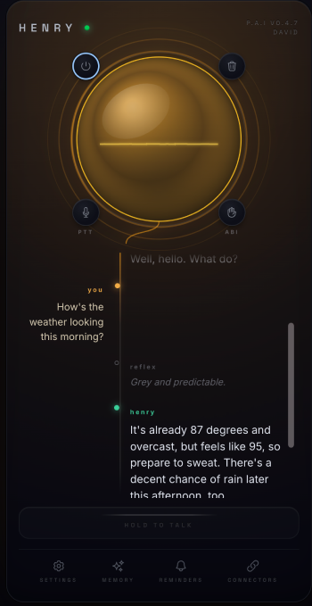
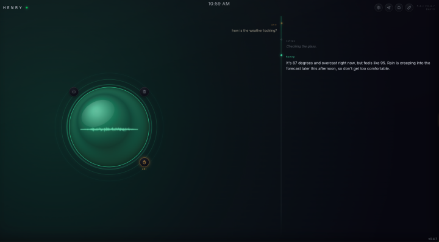
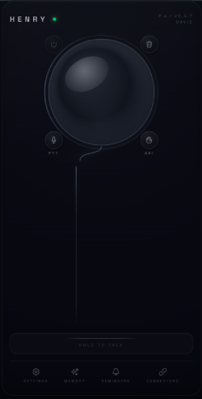

<div align="center">

# Orbital P.A.I 🚀

[](https://elixir-lang.org/)
[](https://www.phoenixframework.org/)
[](https://github.com/)

</div>

---

> [!WARNING]
> **Hold onto your hats!** 🎢
> This project is under **heavy, active development**. Expect sudden breaking changes, plenty of bugs, and a bit of a rollercoaster ride in the short term while the dust settles. Use at your own risk!

# Orbital P.A.I — a naturally-responsive voice assistant

Orbital (I named mine Henry) is a low-latency, voice-first personal assistant built in **Elixir/Phoenix**. You talk; it
answers out loud — fast — and it can actually *do things* (calendar, email, reminders, weather, web
search) through a tool-calling brain. It remembers what matters about you across conversations, works
as an installable PWA, and has a "kiosk" wall mode.

## Screenshots

| Conversation (phone) | Kiosk / wall mode | Powered off |
|---|---|---|
|  |  |  |

The orb is the light source: it glows **amber** while you speak, **green** while the AI speaks, and the
whole surface breathes with the live audio. Your turns run down an amber rail, the AI's down a green one.

## How it works (the pipeline)

```
mic → Cartesia Ink-2 STT → Conversation (gen_statem) ──► reflex  (instant ~1s filler, Gemini minimal)
                                                     └─► brain   (streaming Gemini → Cartesia TTS → audio)
                                                            └─ tools: weather · reminders · calendar · email · web search
```

- **One vendor for voice** — Cartesia **Ink-2** for speech-to-text (native semantic turn detection)
  and **Sonic** for text-to-speech, over one `CARTESIA_API_KEY`.
- **Reflex + brain split** — an instant short "reflex" masks latency while the streaming "brain"
  composes the real answer (Gemini SSE → Cartesia WebSocket → gapless audio). The reflex even gets a
  **head-start** from Ink's `turn.eager_end` prediction, and the brain's answer text **streams to the
  UI live** (a caption that fills word-by-word, then snaps to formatted markdown).
- **Tools** — the brain calls functions (`App.Tools.*`) inline mid-turn: weather (Open-Meteo),
  reminders (SQLite + scheduler), Google **Calendar** (read + create), **Gmail** (search + read +
  send), and **web search** (Gemini grounding).
- **Memory** — durable profile facts + a rolling summary, auto-extracted, shown/editable in the UI.
- **Turn-taking** — Ink-2's **native semantic endpointing** (a mid-thought pause doesn't cut you off),
  a **push-to-talk** mode (hold a button, via Ink's manual finalize), and **barge-in** ("allow
  interruptions" — talk over the AI and they yields, driven by Ink's `turn.start`).
- **Proactive** — a generic *agenda* system delivers self-initiated turns; reminders fire as spoken,
  polite interjections (speak when idle, queue mid-turn, interject at the next breath).
- **Multi-user** — sign-in is gated by an allowlist; each user sees only their own memory, reminders,
  and connected accounts.

## Run it (dev)

Needs Elixir/Erlang, Node (for asset deps), and API keys.

```bash
cp .env.example .env     # fill in GOOGLE_API_KEY, CARTESIA_API_KEY (STT + TTS), Google OAuth,
                         # and ALLOWED_USERS (the sign-in allowlist — set it to your own account)
mix setup                # deps, DB, assets, npm
./dev.sh                 # loads .env, runs the server, tees output to log/companion.log
```

Open the URL it prints (default `http://localhost:8787`, from `PORT` in `.env`), tap the **power**
button, allow the mic, and speak. (Chrome recommended for Web Audio.)

- **Secrets + config** live in `.env` (gitignored) — never commit them. `ALLOWED_USERS` is JSON; see
  `.env.example` for the format.
- **Google Calendar / Gmail** are optional and need a one-time setup of your *own* Google Cloud
  project (OAuth client + enabling the APIs). See **[docs/connectors.md](docs/connectors.md)** for the
  full walkthrough, then connect accounts from the Connectors panel.

## Deploy

Orbital P.A.I ships as a Docker image and runs behind any reverse proxy / tunnel that supports WebSockets
(e.g. a Cloudflare Tunnel). All secrets + host come from environment variables — nothing is baked into
the image. See `docker-compose.yml` and `docs/deploy-coolify.md` for a reference deployment (SQLite on
a persistent volume, `SECRET_KEY_BASE`, `PHX_HOST`, `ALLOWED_USERS`, etc.).

## Project layout

- `lib/app/conversations/` — the turn engine: `Conversation` (gen_statem), `Policy`, `BrainStream`, `Sessions`.
- `lib/app/adapters/` — external services: `Stt.Cartesia` (Ink-2), `TextModel.Gemini`, `Tts.Cartesia` (Sonic).
- `lib/app/agenda*` — generic self-initiated ("agenda") turns; `lib/app/reminders/` — the reminder producer.
- `lib/app/tools/` — the brain's callable tools (`Tool` behaviour + registry).
- `lib/app/google/` — OAuth + Calendar + Gmail; `lib/app/memory/` — facts/summary/turns.
- `lib/app_web/` — `VoiceChannel`, `ConversationLive`, `GoogleAuthController`.
- `assets/js/voice/` — the `Voice` hook (mic capture, gapless playback, the live orb + caption, push-to-talk).

## Cloud LLM vs Local LLMs
his project leans on a handful of paid API keys — Gemini (the LLM), Cartesia (speech-to-text and text-to-speech), and Voyage (embeddings). They cost money, but they get the infrastructure out of the way so I can focus on building features and iterate quickly.

It's not all cloud, though: one model already runs locally, the speaker verifier behind Voice Lock, a small ONNX speaker-embedding model that runs in-process on the CPU. The long-term goal is to bring the heavier pieces local too, especially the LLMs, which would cut costs dramatically.

I don't have enough usage data yet to give a monthly cost estimate with current apis.

## Contributing

Contributions are welcome — see [CONTRIBUTING.md](CONTRIBUTING.md) for setup, the test gate
(`mix precommit`), and conventions. Framework idioms live in `AGENTS.md`.

## License

[MIT](LICENSE) © David Clausen
