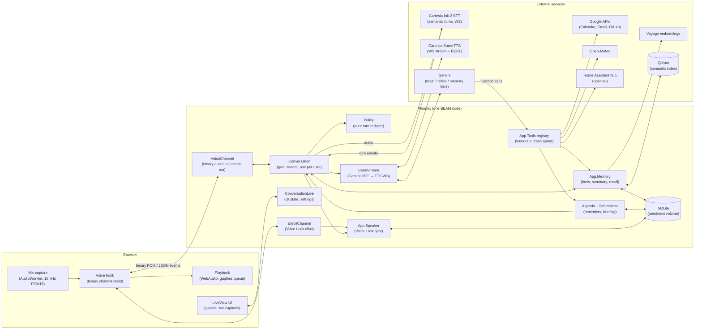
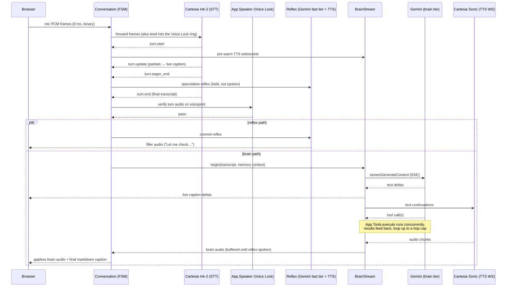
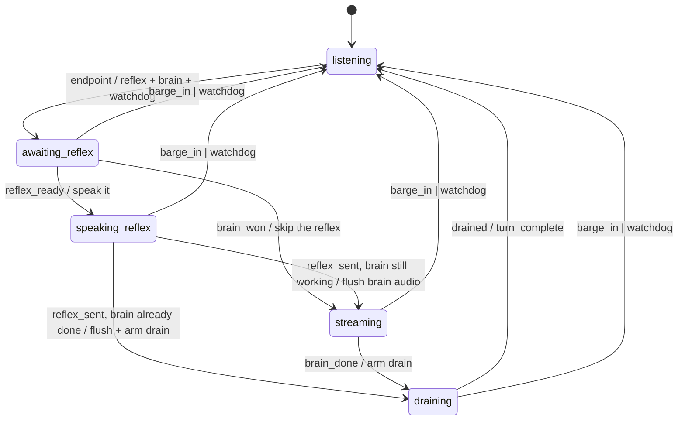
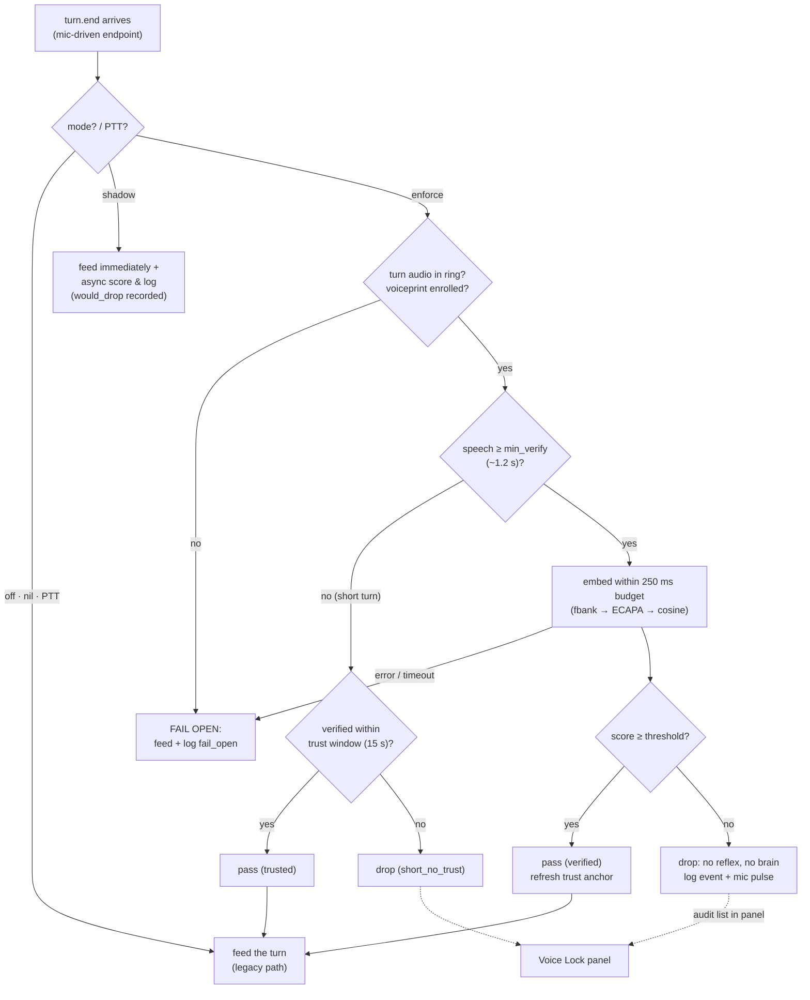
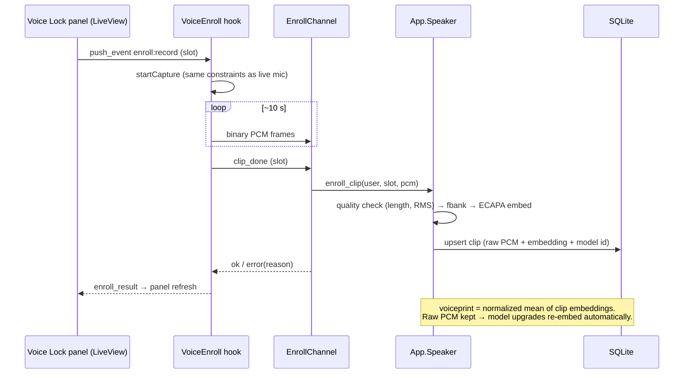
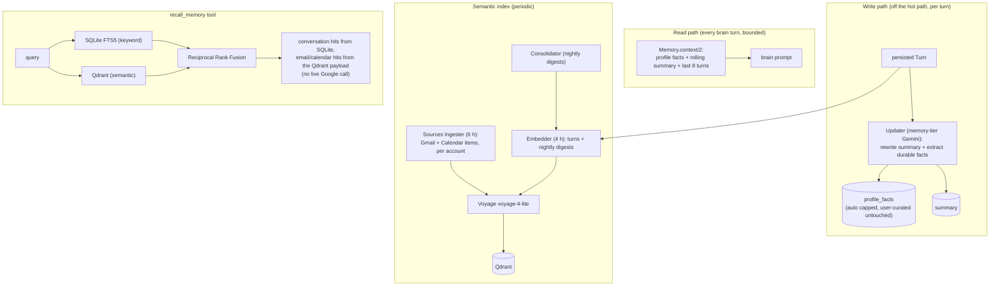
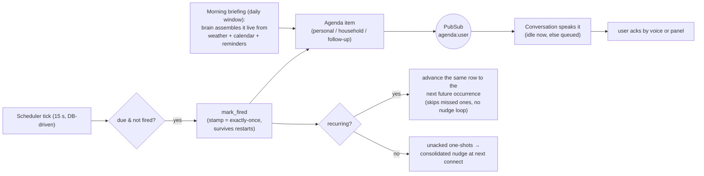
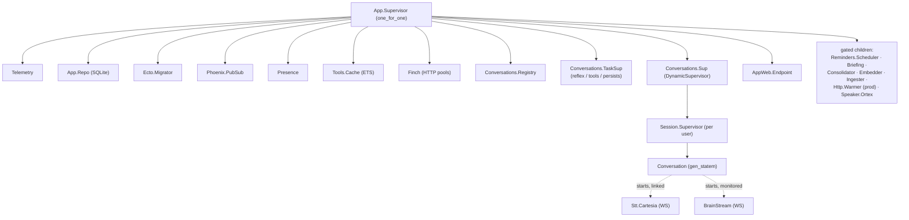

# Architecture

A low-latency, household voice assistant built on Elixir/Phoenix. One BEAM node owns the whole
pipeline: browser mic audio streams over a Phoenix channel into a per-user conversation state
machine, which fans out to streaming STT (Cartesia Ink-2), a streaming LLM brain (Gemini) with
inline tool calls, and streaming TTS (Cartesia Sonic) — with a "reflex" filler phrase covering the
brain's first-token latency. Memory, reminders, connectors, and a speaker-verification gate
("Voice Lock") hang off the same core.

The assistant's name is configurable (`App.Config :name`); this doc calls it "the assistant".

## System overview

Two users share one instance (an allowlist keyed by canonical email). Everything user-facing —
turns, reminders, profile facts, summaries, Google accounts, voiceprints — is scoped by `user_id`.
The voice socket is authenticated with a `Phoenix.Token`; each user gets exactly one
`Conversation` process, found via a `Registry` and kept alive across reconnects by a linger.

## Anatomy of a turn

The pipeline is tuned so speech starts flowing back before the brain has finished thinking:

- **turn.start** (speech onset) pre-warms the brain's TTS websocket so the handshake is already
  done when the transcript lands.
- **turn.eager_end** (Ink predicts the user is done) speculatively starts the reflex LLM call;
  **turn.resume** cancels it.
- **turn.end** commits the turn — after the Voice Lock gate (below) — and the reflex + brain run
  in parallel. Brain audio buffers until the reflex has been spoken, then flushes seamlessly.

**Barge-in** is server-side: a `turn.start` while the assistant is speaking ducks playback
instantly; the next partial with real words confirms the interrupt (stop playback, cancel brain).
An interrupted turn is persisted if already answered, else carried forward so the brain answers
both requests in one go.

**Slow tools** get two covers: a spoken "bridge" phrase (canned filler that never enters the
transcript), and TTS **context rotation** — Cartesia contexts expire ~1 s after their last audio,
so when the brain goes quiet waiting on a tool, `BrainStream` detects the premature `done` and
streams the eventual answer on a fresh context id over the same websocket.

## Turn state machine (Policy)

`Policy` is a pure reducer — the `Conversation` gen_statem owns processes, buffers, and timers,
and executes the effects Policy emits (`generate_reflex`, `start_brain`, `flush_brain`,
`stop_playback`, `cancel_brain`, …).

## Voice Lock (speaker verification)

Only enrolled voices get through in open-mic mode — background speech and song lyrics stop
becoming turns. Per-user tri-state: **off** (default, byte-for-byte legacy behavior), **shadow**
(score + log everything, block nothing — the calibration phase), **enforce**. Push-to-talk is
never gated (it's the deliberate-intent escape hatch), and every malfunction fails **open**.

The verifier runs in-BEAM: mic PCM → Kaldi-compatible log-mel fbank (Nx on the EXLA backend) →
WeSpeaker ECAPA ONNX model under Ortex → L2-normalized embedding → cosine against the user's
enrolled voiceprint.

Enrollment is three guided ~10 s prompts read through the **same** browser capture path as live
turns (same `getUserMedia` DSP, so the voiceprint lives in the same audio domain):

Every gate decision is logged (pruned to the newest 100 per user); shadow mode's score
distributions drive threshold calibration (`App.Speaker.calibration_report/1` in iex), and the
panel's "recently filtered" list makes false positives discoverable.

## Memory

Three tiers: a bounded prompt context (no model calls on the hot path), a post-turn updater, and
a semantic index for recall.

If the vector leg is down, recall degrades to keyword-only — same fail-soft posture as the rest
of the system.

## Reminders, agenda, briefing

All proactive speech funnels through one seam: producers hand `App.Agenda` an item, and the
user's `Conversation` decides *when* to say it (immediately if idle, queued to the next clean
turn boundary otherwise). Reminder turns run context-light so they fulfill in isolation.

## Tools

`App.Tools` is a registry over a `Tool` behaviour (`declarations/0` in Gemini function-declaration
shape, `execute/3`). Every call runs supervised with a per-tool timeout (default 8 s; Gmail's
multi-account fan-out gets 18 s) and a crash guard — a tool failure becomes an `{:error, …}`
function response, never a dead turn. An optional ETS cache (per-tool TTLs, write-invalidation)
skips repeat reads.

Registered today: **Weather** (Open-Meteo), **Reminders** (incl. recurrence + follow-ups),
**Lists** (shared household "books"), **Garden** (plant records + care coaching),
**Calendar** + **Gmail** (multi-account Google, sequential token refresh then parallel fetch),
**Recall** (hybrid memory search), and — only when a hub is configured — **Home Assistant**
(entity search/control with locks/alarms/garage read-only by construction).

## Supervision tree

Adapters (`:stt`, `:tts`, `:text_model`, `:brain_stream`, `:embeddings`, `:vector_store`,
`:speaker_verifier`) resolve through app env and are swapped for controllable fakes in tests; the
optional background workers gate on `start_*` flags so the test suite runs without them.

## Design throughlines

- **Latency is layered, not solved once**: prewarm at speech onset, speculative reflex at
  eager-end, reflex-covers-brain, buffered brain audio, TTS context rotation for slow tools.
- **Pure cores, thin shells**: `Policy`, `Gate`, `Ring`, recurrence math, and wake-word matching
  are pure modules with table-driven tests; processes own only I/O and timers.
- **Fail open, degrade soft**: Voice Lock malfunctions pass turns through; recall falls back to
  keyword search; per-account connector failures are reported, not fatal; STT exits reconnect on
  the next mic frame.
- **Exactly-once by stamps, not memory**: reminders fire off `fired_at` stamps and DB ticks, so
  restarts never double-fire or drop.
- **One writer**: SQLite's single-writer shapes real decisions — sequential token refresh before
  parallel fan-out, `async: false` DB tests, busy-retry on contended writes.
